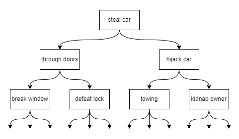
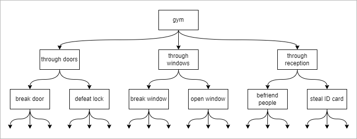
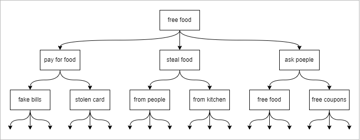
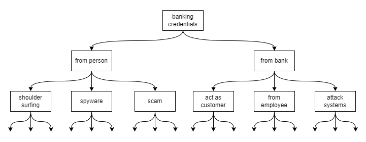
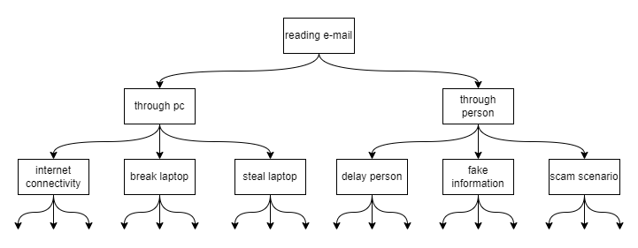
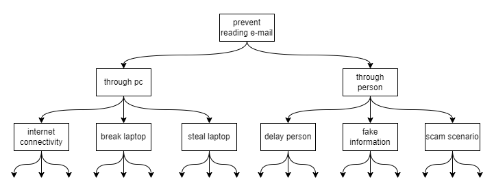
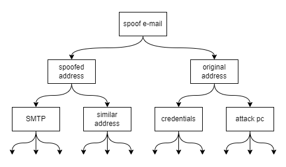

# Chapter 1 - The Context of Cryptography

## Notes

### Exercises for Professional Paranoia

Discuss, think about, and immerse yourself in the subject of computer security.
Perform regular exercises and write reports.
You will gradually develop the professional paranoia mindset.
(Professional paranoia is a sort of security thinking that focuses on how to attack something from the attacker's point of view.)

### Current Event Exercises

Analyze a recent event in the news about computer security.
It should be brief, succinct, thoughtful, and well-written.
Assume a broad readership, with the article helping the reader in understanding the computer security discipline and how it fits into the larger environment.

### Security Review Exercises

Evaluate the potential security and privacy concerns of emerging technologies, assess their severity, and explain ways to handle such security and privacy issues.

- Make a high-level summary of the technology you're evaluating (one or two paragraphs in length). Declare the features relevant to your observations, while also explicitly indicating any assumptions made. If you can't write a concise and clear summary, you probably don't know enough about the technology to evaluate its security and privacy.

- Name at least two assets and a related security goal for each asset, while explaining why the security goals are necessary. One or two phrases per asset or goal should enough.

- Mention at least two probable flaws and support your argument with one or two sentences per flaw. You don't need to completely check if these possible flaws are indeed genuine problems for the purposes of these activities.

- State and outline any defenses that the system could or might already be employing to address previously identified potential flaws.

- Assess the risks associated with the given assets, threats, and possible vulnerabilities. Informally, how serious do you consider these combinations of assets, risks, and possible weaknesses?

- Provide some meaningful conclusions and observations on your previous responses. Discuss broader concerns (ethics, the possibility that technology will advance, and so on).

## General Exercises

### Exercise 1.1 - Create an attack tree for stealing a car. For this and the other attack tree exercises, you can present your attack tree as a figure (like Figure 1.1), or you can present your attack tree as a list numbered in outline form (e.g., 1, 1.1, 1.2, 1.2.1, 1.2.2, 1.3, . . . ).

### Exercise 1.2 - Create an attack tree for getting into a gym without paying.

### Exercise 1.3 - Create an attack tree for getting food from a restaurant without paying.

### Exercise 1.4 - Create an attack tree for learning someone’s online banking account name and password.

### Exercise 1.5 - Create an attack tree for reading someone else’s e-mail.

### Exercise 1.6 - Create an attack tree for preventing someone from being able to read his own e-mail.

### Exercise 1.7 - Create an attack tree for sending e-mail as someone else. Here, the attacker’s goal is to convince an e-mail recipient that an e-mail she receives is from someone else (say, Bob), when in fact Bob never sent that e-mail.

### Exercise 1.8 - Find a new product or system that was announced or released within the last three months. Conduct a security review of that product or system as described in Section 1.12. Pick one of the assets that you identified and construct an attack tree for compromising that asset.

 ***Couldn't find anything for now (or just being lazy). Will return to this later!***

### Exercise 1.9 - Provide a concrete example, selected from media reports or your personal experiences, in which attackers compromised a system by exploiting something other than the weakest link. Describe the system, describe what you view the weakest link of the system to be and why, and describe how the system was compromised.

Modern Teslas are an excellent example. The wireless usage of access keys, such as a mobile phone, is an example of technical innovation in the automobile business. Teslas employ the NFC protocol to get access to the car. IOAcitve Labs recently carried out a *NFC relay attack* against a Tesla Model Y by reverse-engineering Tesla's proprietary NFC protocol. There are two attackers, the first near the targeted automobile, and the second near the owner of the targeted car. This configuration allows the automobile to send signals to the owner and vice versa without the owner having to be near the car or wanting to access it. [1]

### Exercise 1.10 - Describe a concrete example, excluding the ones given in this chapter, where improving the security of a system against one type of attack can increase the likelihood of other attacks.

Again, we'll use the Tesla as an example. By switching from traditional key locks to wireless locks, we strengthen the security of accessing the automobile with a physical key, which is now obsolete. Unfortunately, the advent of NFC enabled the attackers to get access to the automobile.

## References

[1] [NFC Relay Attack On Tesla Model Y](https://labs.ioactive.com/2022/09/nfc-relay-attack-on-tesla-model-y-josep.html)
