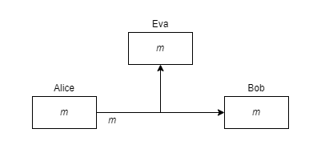
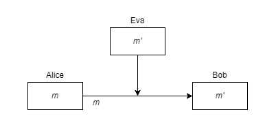
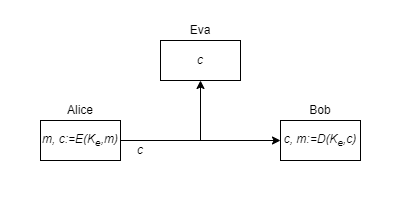
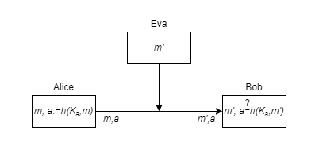
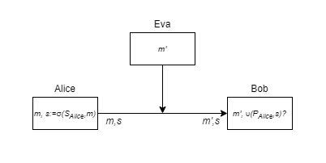

# Chapter 1 - The Context of Cryptography

## Notes

### Kerckhoff's principle

The security of the encryption scheme must depend only on the secrecy of the encryption key, and not on the secrecy of the algorithm.

### Something To Think About

***Don't trust secret algorithms.***

## Exercises

### Exercise 2.1 - Consider Kerckhoffs’ principle. Provide at least two arguments in favor of Kerckhoffs’ principle and at least two arguments against Kerckhoffs’ principle. Then state and argue your view of the validity of Kerckhoffs’ principle.

>Arguments in favor of Kerckhoffs’ principle:
> 
>1. Algorithms are hard to change, especially when they're built into software and hardware, which can be difficult to update.
>
>2. It's hard to keep a key secret, let alone the whole algorithm. 
>
>Arguments against Kerckhoffs’ principle:
> 
>1. Sometimes, due to national security, the encryption scheme must be kept secret.
>
>2. Keeping the encryption scheme secret does not impair its security since it can still be tested by those with access to it.
>
> Statement and arguments of my view of the validity of Kerckhoff's principle:
>
> - In most, if not all, circumstances, making the encryption scheme public is the best way to assure its security. If it is not overlooked, numerous experts will look at it and test it to determine if there are any errors (vulnerabilities).

### Exercise 2.2 - Suppose Alice and Bob are sending e-mails to each other over the Internet. They’re sending these e-mails from their laptops, which are connected to free wireless networks provided by their favorite coffee shops.

- **List all the parties who might be able to attack this system and what they
might be able to accomplish.**

> Assuming the emails are not encrypted, a third-party attacker Eva might intercept emails from Alice to Bob and vice versa. Eva may freely read them because they are in plaintext form.
>
> 
> 
> Eva can also intercept the e-mail and send a different one instead, thus acting as the original sender (in this case Eva).
>
> 

- **Describe how Alice and Bob might be able to defend against each of the
attacks you identified above. Be as specific as possible.**

> In the first case, Alice and Bob can employ an encryption scheme to ensure the *confidentiality* of their e-mails. They must first agree on a secret key that will be used to encrypt and decrypt the message. Alice uses the secret key to encrypt the message (plaintext), resulting in ciphertext. This ciphertext is sent to Bob, who decrypts it using the secret key to obtain the original message. Even if Eva intercepts the email, it will be in ciphertext and will be impossible to decipher without the secret key.
> 
> 
> 
> In the second case, a MAC can be used to verify the *authenticity* of the original message (Message Authentication Code). Using the MAC function and the authentication key, a MAC of the original message is computed. If Eva intercepts Alice's message with her own, the MAC will not match since Bob is comparing the original MAC with Eva's message's MAC. Eva will be unable to spoof the MAC since Alice and Bob are using a pre-agreed authentication key. Bob will only accept the message if it has by a valid MAC.
> 
> 
> 
> Another way to implement authenticity in this case is to use digital signatures, an asymmetrical equivalent of symmetrical MAC. Alice singes her message with her secret key and sends the signed message to Bob. Eva intercepts the message, replaces it with her own, but Bob verifies the signature with Alice's public key. In case they don't match, the message is discarded.
> 
> 

### Exercise 2.3 - Consider a group of 30 people who wish to establish pair-wise secure communications using symmetric-key cryptography. How many keys need to be exchanged in total?

> There are 30 people (*n = 30*), and for each pair (*r = 2*) a single key will be needed. For this we'll use the *Binomial coefficient*:
> 
> $C(n,r)=\binom{n}{r}=\frac{n!}{r!(n - r)!}\rightarrow C(30,2)=\binom{30}{2}=\frac{30!}{2!(30 - 2)!}=435$

### Exercise 2.4 - Suppose Bob receives a message signed using a digital signature scheme with Alice’s secret signing key. Does this prove that Alice saw the message in question and chose to sign it?

> Alice does not personally sign the note, but her computer does. As a result, the digital signature provides no proof that Alice signed the message or even saw it on her computer. As a result, the digital signature proves virtually little in this case. Eva could somehow get access to Alice's secret key, which she then uses to sign her own message and sending it to Bob.

### Exercise 2.5 - Suppose that PKIs, as we describe in Section 2.5, do not exist. Suppose Alice obtains a public key *P* that purportedly belongs to Bob. How can Alice develop confidence that *P* really belongs to Bob? Consider this question in each of the following scenarios:

- **Alice can talk with Bob over the phone.**

> We assume, that the communication channel over the phone is secure. Alice and Bob are on talking over the phone. Bob signs his own message with his private key and sends it to Alice. She receives the message signed by Bob, verifies the signature using Bob's public key, and she automatically asks Bob has signed the message. If Bob verifies the content of the message (signed by him), Alice can conclude, that the public key really belongs to Bob.

- **Alice can talk with someone else she trusts over the phone (let’s call him Charlie), and Charlie has already verified that *P* belongs to Bob.**

> We're assuming that Alice trusts Charlie. Alice asks Charlie over the phone, if the public key she got really belongs to Bob. Because she trusts Charlie, she can also trust the supposed Bob's public key.

- **Alice can communicate with Charlie via e-mail, and Charlie has already verified that *P* belongs to Bob.**

> We're assuming that Alice does not trust Charlie. Since Charlie cannot be trusted, Alice has no way how to verify Bob's public key. For example, Charlie can give Eva his own public key and claim, that it belongs to Bob.

### Exercise 2.6 - Suppose a chosen-ciphertext attacker cannot recover the secret decryption key for an encryption scheme. Does this mean the encryption scheme is secure?

> In chosen-ciphertext model it is possible for any plaintext value to get a corresponding ciphertext, and for any ciphertext the attacker gets a corresponding plaintext. The encryption scheme is partially secure. Even tho the decryption key cannot be recovered, the attacker could still generate an identical plaintext and get the correct corresponding ciphertext (and vice verse). This is highly unlikely in modern encryption schemes, but still a vulnerability.

### Exercise 2.7 - Consider a symmetric-key cryptosystem in which cryptographic keys are randomly selected from the set of all *n*-bit strings. Approximately what should *n* be in order to provide 128 bits of security against a birthday attack?

> There are $2^{128}$ different 128-bit keys.
> 
> Picking one key at random, to exhaustively search for this key requires trying on average $2^{127}$ key.
> 
> We can expect a *collision* after selecting approximately $2^{64}$ random key. Thus, *n* = 64 bits should provide security against collision attacks, not 128 bits.
