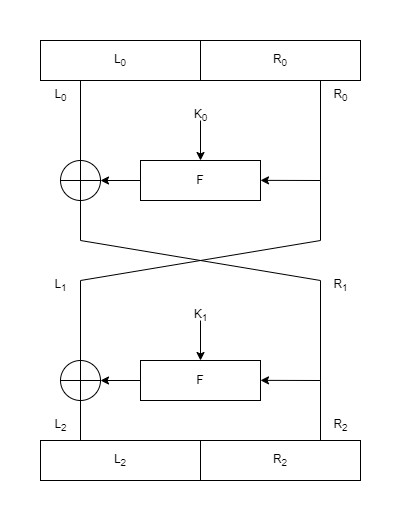
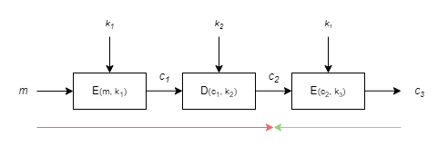

# Chapter 3 - Block Ciphers

## Notes

### Definition of Block Cipher Security

- **Definition 1** - *A secure block cipher is one for which no attack exists.*

- **Definition 2** - *An attack on a block cipher is a non-generic method of distinguishing the bock cipher from an ideal block cipher.*

- **Definition 3** - *An ideal block cipher implements an independently chosen random even permutation for each of the key values.*

### Block cipher

A block cipher with a block size of *k* bits specifies a permutation o *k*-bit output. The maximum key size (in bits) in this case is

$log_{2}2^{k}!\approx (k-1)2^{k}$

## Exercises

### Exercise 3.1 - How much space would be required to store a table for an entire idealized block cipher that operates on 64-bit blocks and that has 80-bit keys?

> $k=64,n=80$
> 
> $k2^{k+n}\rightarrow 64\cdot 2^{64+80}$ 

### Exercise 3.2 - How many rounds are in DES? How many bits are in a DES key? What is the DES block size? How does 3DES work as a function of DES?

> number of rounds = 16
> 
> key size = 56 bits
> 
> block size = 64 bits
> 
> $3DES=E_{K_{3}}(D_{K_{2}}(E_{K_{1}}(P)))$

### Exercise 3.3 - What are the possible lengths for AES keys? For each key length, how many rounds are in AES? What is the AES block size?

> Possible key sizes are: 128, 192 and 256
> 
> $K_{128}=10$ rounds, $K_{192}=12$ rounds and $K_{256}=14$ rounds
> 
> block size = 16 bytes (128 bits)

### Exercise 3.4 - Under what situations might you choose 3DES over AES? Under what situations might you chose AES over 3DES?

> 3DES should be chosen over AES only if you have to be backward-compatible, or locked into a 64-bit block size by other parts of the system.

### Exercise 3.5 - Suppose you have a processor that can perform a single DES encryption or decryption operation in $2^{−26}$ seconds. Suppose you also have a large number of plaintext-ciphertext pairs for DES under a single, unknown key. How many hours would it take, on average, to find that DES key, using an exhaustive search approach and a single processor? How many hours would it take, on average, to find that DES key, using an exhaustive search approach and a collection of $2^{14}$ processors?

> Assuming that *single DES encryption or decryption operation* means a single round.
> 
> One encryption/decryption operation: 2^{-26} seconds
> 
> Amount of rounds for encryption/decryption: $16$ rounds
> 
> Time for full encryption/decryption:
> 
> 16\cdot 2^{-26}=16\cdot\frac{1}{2^{26}}=\frac{2^{4}}{2^{26}}=\frac{1}{2^{22}}=2^{-22}
> 
> All possible keys: $2^{56}$
> 
> For any randomly chosen plaintext/ciphertext pair we try all possible combinations for the key. Thus, on a single processor it should take around:
>
> $2^{-22}\cdot 2^{56}=2^{34}$ seconds.

### Exercise 3.6 - Consider a new block cipher, DES2, that consists only of two rounds of the DES block cipher. DES2 has the same block and key size as DES. For this question you should consider the DES F function as a black box that takes two inputs, a 32-bit data segment and a 48-bit round key, and that produces a 32-bit output.<br/>&emsp;Suppose you have a large number of plaintext-ciphertext pairs for DES2 under a single, unknown key. Give an algorithm for recovering the 48-bit round key for round 1 and the 48-bit round key for round 2. Your algorithm should require fewer operations than an exhaustive search for an entire 56-bit DES key. Can your algorithm be converted into a distinguishing attack against DES2?

> 
> 
> $L_{1}=R_{0}$
> 
> $R_{1}=L_{0}\bigoplus F(R_{0},K_{0})$
> 
> $L_{2}=L_{1}\bigoplus F(R_{1},K_{1})=R_{0}\bigoplus F(L_{0}\bigoplus F(R_{0},K_{0}),K_{1})$
> 
> $R_{2}=R_{1}=L_{0}\bigoplus F(R_{0},K_{0})$
> 
> A very rough draft of the algorithm:
> 
> 1. Randomly pick a plaintext and ciphertext values $L_{0},R_{0},L_{2},R_{2}$
> 2. Find $K_{0}$
>    1. Pick a random $K_{0}$ value
>    2. Compute $L_{0}\bigoplus F(R_{0},K_{0})$
>    3. If $R_{2}=R_{1}=L_{0}\bigoplus F(R_{0},K_{0})$, then we have found $K_{0}$, repeat if not found
> 3. Find $K_{1}$
>    1. Pick a random $K_{0}$ value
>    2. Compute $L_{0}\bigoplus F(R_{0},K_{0})$
>    3. If $R_{1}=L_{0}\bigoplus F(R_{0},K_{0})$, then we have found $K_{1}$, repeat if not found
> 
> This way, we only need to test out $2^{48}$ possible combinations for the key, which is significantly less than $2^{56} for 56-bit key size.
> 
> $2\cdot 2^{48}=2^{49}\ll2^{56}$

### Exercise 3.7 - Describe an example system that uses DES but is insecure because of the DES complementation property. Specifically, describe the system, and then present an attack against that system; the attack should utilize the DES complementation property.

> 
> 
> The red arrow $D_{K_{2}}(E_{K_{1}}(m))$ represents a case with the complementation property, thus you have to compute approximately $2^{110}$ keys instead of $2^{112}$.
> 
> The greed arrow $E_{K_{1}}(m)$ represents a case with the complementation property, where you only need to compute $2^{55}$ keys instead of $2^{56}$.

### Exercise 3.8 - Familiarize yourself with a cryptographic software development package for your computer. A popular open source package is OpenSSL, though there are numerous other alternatives.<br/>&emsp;Using an existing cryptography library, decrypt the following ciphertext (in hex)<br/>&emsp;53 9B 33 3B 39 70 6D 14 90 28 CF E1 D9 D4 A4 07<br/>with the following 256-bit key (also in hex)<br/>&emsp;80 00 00 00 00 00 00 00 00 00 00 00 00 00 00 00<br/>&emsp;00 00 00 00 00 00 00 00 00 00 00 00 00 00 00 01<br/>using AES.

> ```python
> #! /usr/bin/env python
>
> from Crypto.Cipher import AES
> 
> def main():
>     ciphertext = bytes.fromhex(
>         "53 9B 33 3B 39 70 6D 14 90 28 CF E1 D9 D4 A4 07"
>     )
> 
>     key = bytes.fromhex(
>         "80 00 00 00 00 00 00 00 00 00 00 00 00 00 00 00 00 00 00 00 00 00 00 00 00 00 00 00 00 00 00 01"
>     )
> 
>     plaintext = AES.new(key=key,mode=AES.MODE_ECB).decrypt(ciphertext)
>     print(plaintext.hex(" "))
> 
> if __name__ == "__main__":
>     main()
> ```
> 
> Output: 80 70 60 50 40 30 20 10 08 07 06 05 04 03 02 01

### Exercise 3.9 - Using an existing cryptography library, encrypt the following plaintext (in hex)<br/>&emsp;29 6C 93 FD F4 99 AA EB 41 94 BA BC 2E 63 56 1D<br/>with the following 256-bit key (also in hex)<br/>&emsp;80 00 00 00 00 00 00 00 00 00 00 00 00 00 00 00<br/>&emsp;00 00 00 00 00 00 00 00 00 00 00 00 00 00 00 01<br/>using AES.

> ```python
> #! /usr/bin/env python
>
> from Crypto.Cipher import AES
> 
> def main():
>     plaintext = bytes.fromhex(
>         "29 6C 93 FD F4 99 AA EB 41 94 BA BC 2E 63 56 1D"
>     )
> 
>     key = bytes.fromhex(
>         "80 00 00 00 00 00 00 00 00 00 00 00 00 00 00 00 00 00 00 00 00 00 00 00 00 00 00 00 00 00 00 01"
>     )
> 
>     ciphertext = AES.new(key=key,mode=AES.MODE_ECB).encrypt(plaintext)
>     print(ciphertext.hex(" "))
> 
> if __name__ == "__main__":
>     main()
> ```
> 
> Output: 80 00 00 00 00 00 00 00 00 00 00 00 00 00 00 01

### Exercise 3.10 - Write a program that experimentally demonstrates the complementation property for DES. This program should take as input a key K and a plaintext P and demonstrate that the DES complementation property holds for this key and plaintext. You may use an existing cryptography library for this exercise.

> Complementation property of DES: $E(\overline{K},\overline{P})=\overline{E(K,P)}$
>
> ```python
> #! /usr/bin/env python
> 
> from Crypto.Cipher import DES
> 
> 
> def complement(byte_string: bytes) -> bytes:
>     return bytes((byte ^ 0xFF) for byte in byte_string)
> 
> 
> def main() -> None:
>     key = bytes.fromhex("0102030405060708")
>     plaintext = bytes.fromhex("1020304050607080")
>     ciphertext = DES.new(key=key,mode=DES.MODE_ECB).encrypt(plaintext)
> 
>     complementKey = complement(key)
>     complementPlaintext = complement(plaintext)
>     complementCiphertext = DES.new(key=complementKey,mode=DES.MODE_ECB).encrypt(complementPlaintext)
> 
>     assert complement(ciphertext) == complementCiphertext
> 
> if __name__ == "__main__":
>     main()
> ```

## References

[1] [NFC Relay Attack On Tesla Model Y](https://labs.ioactive.com/2022/09/nfc-relay-attack-on-tesla-model-y-josep.html)
