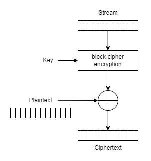

# Chapter 4 - Block Cipher Modes

## Exercises

### Exercise 3.1 - Let P be a plaintext and let $l(P)$ be the length of $P$ in bytes. Let $b$ be the block size of the block cipher in bytes. Explain why the following is *not* a good padding scheme: Determine the minimum number of padding bytes necessary in order to pad the plaintext to a block boundary. This is a number $n$ which satisfies $0\leq n\leq b-1$ and $n+l(p)$ is a multiple of $b$. Pad the plaintext by appending $n$ bytes, each with value $n$. 

> $b=16,n=b=16$
> 
> 0\leq n\leq b-1\Rightarrow 0\leq b\leq b-1\Rightarrow 0\leq 16\leq 16 - 1\Rightarrow 0\leq 16\leq 15$
> 
> As you can see, we can't pad an *entire* block. As a result, if we need an input of, say, 32 bytes but only have 16 bytes of message, we can't pad the other 16 bytes.

### Exercise 3.2 - Compare the security and performance advantages and disadvantages of each variant of CBC mode covered in this chapter: a fixed IV, a counter IV, a random IV, and a nonce-generated IV.

> 1. Fixed IV
>    1. Advantages: None
>    2. Disadvantages: Highly nonrandom messages. Same first ciphertext block for two different messages. Detectable repeating blocks.
> 2. Counter IV
>    1. Advantages: Better than fixed IV.
>    2. Disadvantages: Highly nonrandom messages. Same or similar ciphertext blocks for two different messages.
> 3. Random IV
>    1. Advantages: Highly random messages.
>    2. Disadvantages: Transmitting the IV to the recipient. Ciphertext is one block longer than the plaintext.
> 4. Nonce-Generated IV
>    1. Advantages: Unique nonce combined with the counter provides really high randomization. Nonce doest not need to be secret.
>    2. Disadvantages: Nonce can be used only once. The need to ensure nonce uniqueness.

### Exercise 3.3 - Suppose you, as an attacker, observe the following 32-byte ciphertext $C$ (in hex)<br/>&emsp;46 64 DC 06 97 BB FE 69 33 07 15 07 9B A6 C2 3D<br/>&emsp;2B 84 DE 4F 90 8D 7D 34 AA CE 96 8B 64 F3 DF 75<br/>and the following 32-byte ciphertext $C^{'}$ (also in hex)<br/>&emsp;51 7E CC 05 C3 BD EA 3B 33 57 0E 1B D8 97 D5 30<br/>&emsp;7B D0 91 6B 8D 82 6B 35 B7 8B BB 8D 74 E2 C7 3B.<br/>Suppose you know these ciphertexts were generated using CTR mode with the same nonce. The nonce is implicit, so it is not included in the ciphertext. You also know that the plaintext $P$ corresponding to $C$ is<br/>&emsp;43 72 79 70 74 6F 67 72 61 70 68 79 20 43 72 79<br/>&emsp;70 74 6F 67 72 61 70 68 79 20 43 72 79 70 74 6F.<br/>What information, if any, can you infer about the plaintext $P^{'}$ corresponding to $C^{'}$?

> 
> 
> $C_{1}=E_{K}(S)\bigoplus P_{1}\Rightarrow E_{K}(S)=P_{1}\bigoplus C_{1}$
> 
> $C_{2}=E_{K}(S)\bigoplus P_{2}\Rightarrow P_{2}=E_{K}(S)\bigoplus C_{2}\Rightarrow P_{2}=P_{1}\bigoplus C_{1}\bigoplus C_{2}$
> 
> ```python
> #! /usr/bin/env python
> 
> def main() -> None:
>     ciphertext1 = bytes.fromhex(
>         "46 64 DC 06 97 BB FE 69 33 07 15 07 9B A6 C2 3D"
>         "2B 84 DE 4F 90 8D 7D 34 AA CE 96 8B 64 F3 DF 75"
>     )
> 
>     ciphertext2 = bytes.fromhex(
>         "51 7E CC 05 C3 BD EA 3B 33 57 0E 1B D8 97 D5 30"
>         "7B D0 91 6B 8D 82 6B 35 B7 8B BB 8D 74 E2 C7 3B"
>     )
> 
>     plaintext1 = bytes.fromhex(
>         "43 72 79 70 74 6F 67 72 61 70 68 79 20 43 72 79"
>         "70 74 6F 67 72 61 70 68 79 20 43 72 79 70 74 6F"
>     )
> 
>     stream = bytes(a ^ b for (a, b) in zip(plaintext1, ciphertext1))
> 
>     plaintext2 = bytes(a ^ b for (a, b) in zip(stream, ciphertext2))
>     print(plaintext2.hex(" "))
> 
> if __name__ == "__main__":
>     main()
> ```
> 
> Output:
> <br/>&emsp;bc 5b e7 e6 0f 9d 30 27 a7 42 30 1b 22 42 7d d7
> <br/>&emsp;c4 6c d8 7b ff 30 9b 00 8f ba 18 85 68 4d 16 3b

### Exercise 3.4 - The ciphertext (in hex)<br/>&emsp;87 F3 48 FF 79 B8 11 AF 38 57 D6 71 8E 5F 0F 91<br/>&emsp;7C 3D 26 F7 73 77 63 5A 5E 43 E9 B5 CC 5D 05 92<br/>&emsp;6E 26 FF C5 22 0D C7 D4 05 F1 70 86 70 E6 E0 17<br/>was generated with the 256-bit AES key (also in hex)<br/>&emsp;80 00 00 00 00 00 00 00 00 00 00 00 00 00 00 00<br/>&emsp;00 00 00 00 00 00 00 00 00 00 00 00 00 00 00 01<br/>using CBC mode with a random IV. The IV is included at the beginning of the ciphertext. Decrypt this ciphertext. You may use an existing cryptography library for this exercise.

> ```python
> #! /usr/bin/env python
>
> from Crypto.Cipher import AES
>
>
> def main() -> None:
>     plaintext = bytes.fromhex(
>         "62 6C 6F 63 6B 20 63 69 70 68 65 72 73 20 20 20"
>         "68 61 73 68 20 66 75 6E 63 74 69 6F 6E 73 20 78"
>         "62 6C 6F 63 6B 20 63 69 70 68 65 72 73 20 20 20"
>     )
> 
>     key = bytes.fromhex(
>         "80 00 00 00 00 00 00 00 00 00 00 00 00 00 00 00"
>         "00 00 00 00 00 00 00 00 00 00 00 00 00 00 00 01"
>     )
> 
>     ciphertext = AES.new(key=key,mode=AES.MODE_ECB).encrypt(plaintext)
>     print(ciphertext.hex(" "))
> 
> if __name__ == "__main__":
>     main()
> ```
> 
> Output:
> <br/>&emsp;54 68 69 73 20 69 73 20 61 20 73 65 63 72 65 74
> <br/>&emsp;20 20 20 43 6f 6e 66 69 64 65 6e 74 69 61 6c 21

### Exercise 3.5 - Encrypt the plaintext<br/>&emsp;62 6C 6F 63 6B 20 63 69 70 68 65 72 73 20 20 20<br/>&emsp;68 61 73 68 20 66 75 6E 63 74 69 6F 6E 73 20 78<br/>&emsp;62 6C 6F 63 6B 20 63 69 70 68 65 72 73 20 20 20<br/>using AES in ECB mode and the key<br/>&emsp;80 00 00 00 00 00 00 00 00 00 00 00 00 00 00 00<br/>&emsp;00 00 00 00 00 00 00 00 00 00 00 00 00 00 00 01.<br/>You may use an existing cryptography library for this exercise.

> ```python
> #! /usr/bin/env python
> 
> from Crypto.Cipher import AES
> 
> def main() -> None:
>     iv = bytes.fromhex(
>         "87 F3 48 FF 79 B8 11 AF 38 57 D6 71 8E 5F 0F 91"
>     )
> 
>     plaintext = bytes.fromhex(
>         "7C 3D 26 F7 73 77 63 5A 5E 43 E9 B5 CC 5D 05 92"
>         "6E 26 FF C5 22 0D C7 D4 05 F1 70 86 70 E6 E0 17"
>     )
> 
>     key = bytes.fromhex(
>         "80 00 00 00 00 00 00 00 00 00 00 00 00 00 00 00"
>         "00 00 00 00 00 00 00 00 00 00 00 00 00 00 00 01"
>     )
> 
>     ciphertext = AES.new(key=key,mode=AES.MODE_CBC,iv=iv).encrypt(plaintext)
>     print(ciphertext.hex(" "))
> 
> if __name__ == "__main__":
>     main()
> ```
> 
> Output:
> <br/>&emsp;9b 75 b3 76 fd c7 83 bd 0d ff 4a c4 40 78 ea 8e 66 55 f4 22 2c 0d 41 33
> <br/>&emsp;64 f7 48 e0 8f 18 05 13 9b 75 b3 76 fd c7 83 bd 0d ff 4a c4 40 78 ea 8e

### Exercise 3.6 - Let $P1$, $P2$ be a message that is two blocks long, and let $P^{'}\_{1}$ be a message that is one block long. Let $C_{0}$, $C_{1}$, $C_{2}$ be the encryption of $P_{1}$, $P_{2}$ using CBC mode with a random IV and a random key, and let $C^{'}\_{0}$, $C^{'}\_{1}$ be the encryption of $P^{'}\_{1}$ using CBC mode with a random IV and the same key. Suppose an attacker knows $P_{1}$, $P_{2}$ and suppose the attacker intercepted and thus know $C_{0}$, $C_{1}$, $C_{2}$ and $C^{'}\_{0}$, $C^{'}\_{1}$. Further suppose that, by random chance, $C^{'}\_{1}=C_{2}$. Show that the attacker can compute $P^{'}\_{1}$.

> Known values: $P_{1}, P_{2}, C_{0}, C_{1}, C_{2}, C^{'}\_{0}, C^{'}\_{1}$
> 
> $K_{1}=K_{2}=K, C^{'}\_{1}=C_{2}$
> 
> $P_{1}=D(K,C_{1})\bigoplus C_{0},P_{2}=D(K,C_{2})\bigoplus C_{1}\Rightarrow D(K,C_{2})=P_{2}\bigoplus C_{1}$
> 
> $P^{'}\_{1}=D(K,C^{'}\_{1})\bigoplus C^{'}\_{0}=D(K,C\_{2})\bigoplus C^{'}\_{0}=P_{2}\bigoplus C_{1}\bigoplus C^{'}\_{0}$
